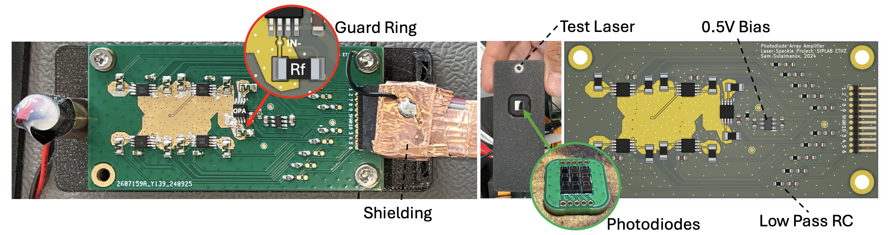
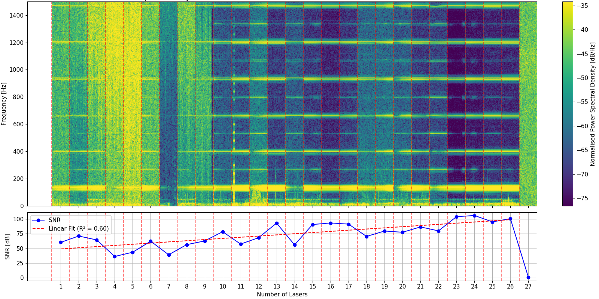
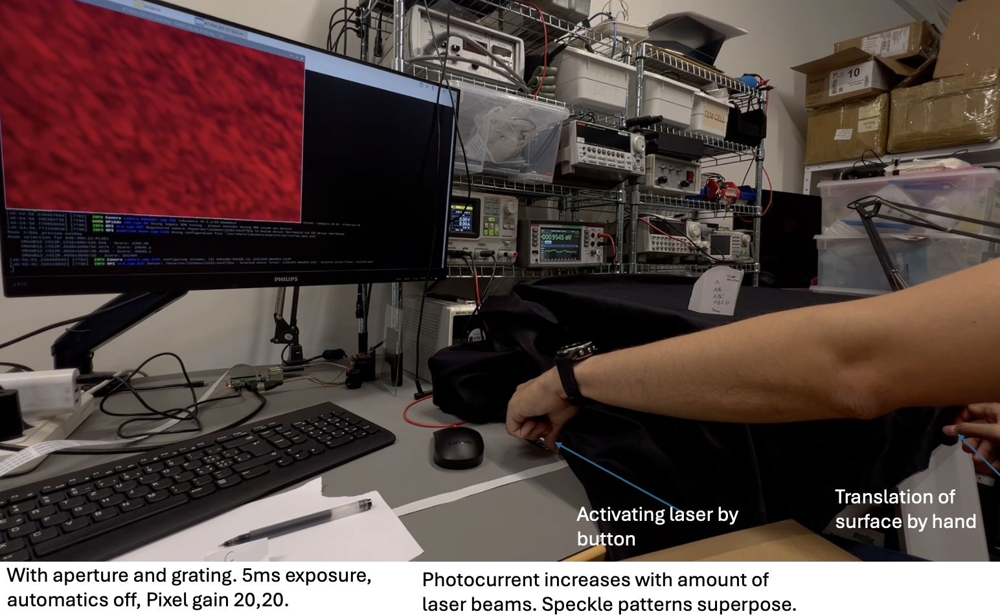
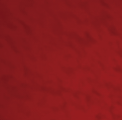
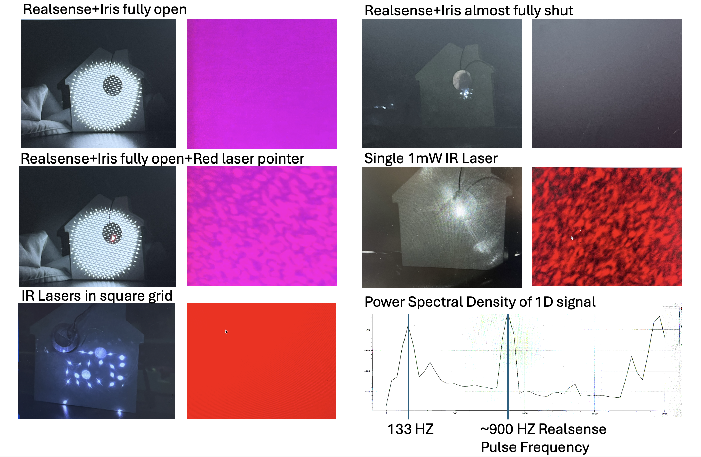

# specklesensor
A photodiode array for laser speckle sensing and vibrometry.

Read the full paper [here](docs/thesis.pdf).

Spectral analysis of a 133 Hz surface vibration under different laser configurations. Top: Power spectral density showing the target frequency
component. Bottom: SNR improvement with increasing number of active lasers:

## RPI Camera Bench Setup

Side by side comparison of the speckle pattern captured by a Raspberry Pi camera with
one red laser

and three red lasers.

## Laser setups

## Hardware
The PCBs used for the experiments are in the `hardware` folder. The PCBs are designed using KiCad, an open source schematics and layout editor. The PCBs were manufactured by JLCPCB and hand assembled using hot air reflow.

- `speckle_pcb_rev1`: The 3x3 photodiode array.
- `speckle_amp_pcb_rev1`: The amplifier PCB for 3x3 array.

Careful attention must be paid to cleaning the PCBs after soldering, as any residue flux can lead to leakage currents and noise in the measurements.

## Scripts
- `emulations`: The script to process camera frames to CSV files for emulating the photodiode array. A notebook provides the signal processing.
- `waveshare`: Scripts for testing the first ADC.
- `daqhat`: Scripts for testing the second ADC and data from the multi-laser experiment.